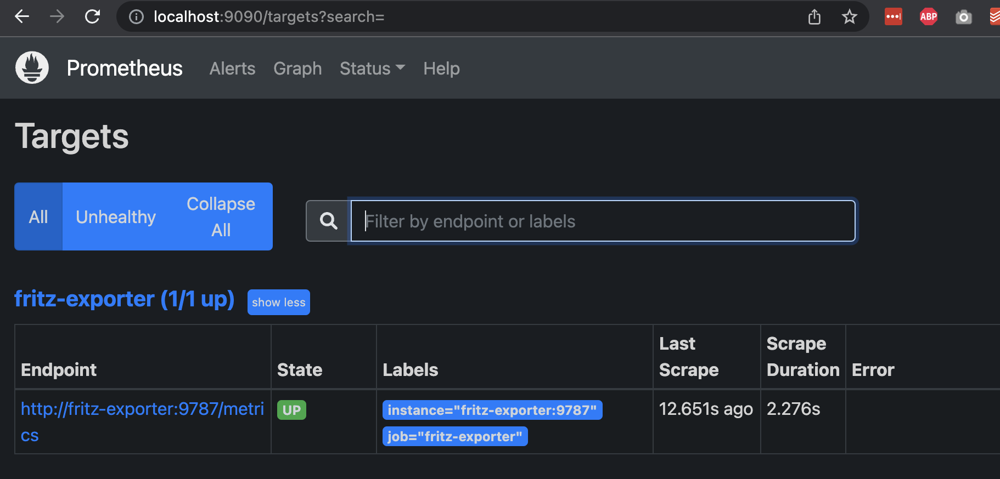
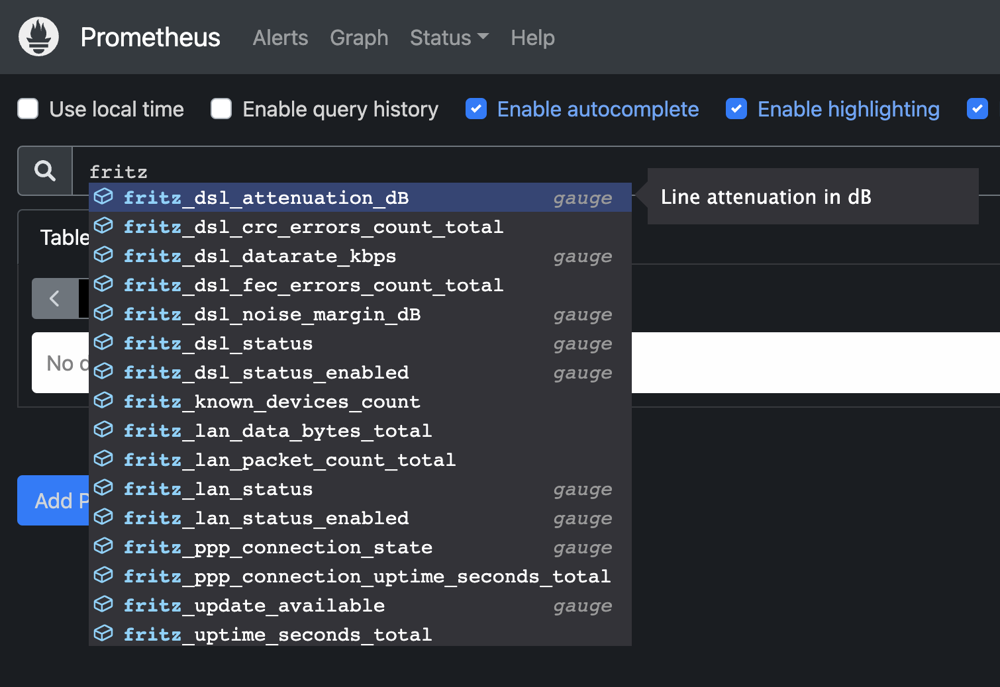
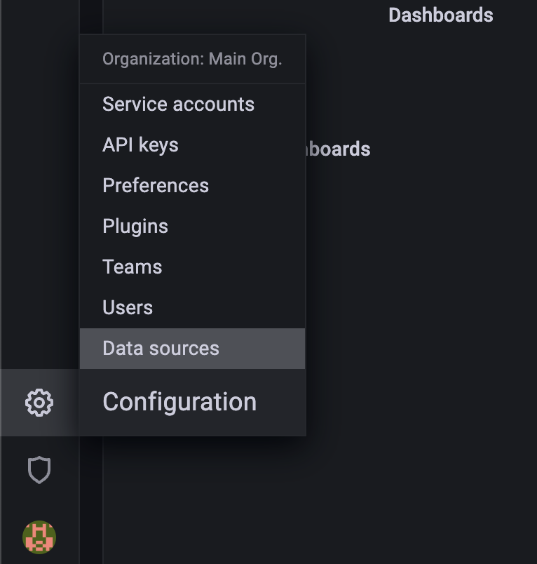
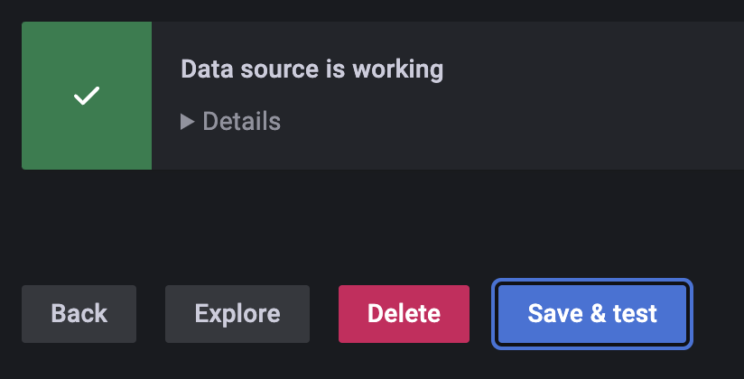
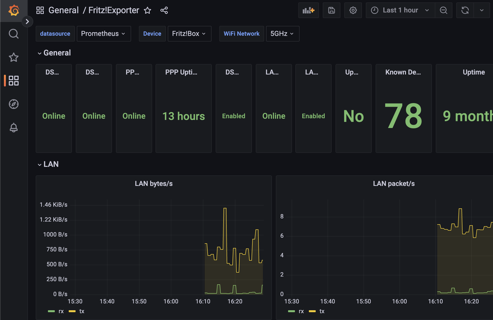

.. _quickstart:

Quickstart
==========

This Quickstart is intended for users, who have no current Prometheus or Grafana instance running. This will use docker-compose to run the exporter, prometheus and Grafana. This will also require some configuration in Grafana to connect to prometheus.

.. note::

  Please understand that configuring Prometheus and Grafana are not part of this exporter and as such this is just intended to give a quick starting point. Problems with setting up and configuring either Prometheus and Grafana are out of scope for this quickstart. Please refrain from opening issues against this exporter for Prometheus or Grafana problems.

Preparations
------------

Create an empty directory ``fritz-exporter`` and place a file ``docker-compose.yml`` in that directory with the following content (Check that environment variables and paths match your setup):

.. code-block:: yaml

  version: "3.8"
  services:
    fritz-exporter:
      image: pdreker/fritz_exporter:2
      container_name: fritz-exporter
      restart: unless-stopped
      environment:
        FRITZ_HOSTNAME: '192.168.178.1'
        FRITZ_USERNAME: 'xxxxx'
        FRITZ_PASSWORD: 'xxxx'
      ports:
        - "9787:9787"

    prometheus:
      container_name: prometheus
      image: prom/prometheus:v2.38.0
      restart: unless-stopped
      volumes:
        - ./prometheus/:/etc/prometheus/
      ports:
        - 9090:9090

    grafana:
      container_name: grafana
      image: grafana/grafana:9.1.6
      ports:
        - 3000:3000

Create another empty directory ``prometheus`` next to the ``docker-compose.yml`` file and put a file ``prometheus.yml`` into it with the following content:

.. code-block:: yaml

  global:
    scrape_interval: 15s
    evaluation_interval: 15s

  scrape_configs:
    - job_name: "fritz-exporter"
      scrape_interval: 60s
      static_configs:
        - targets: ["fritz-exporter:9787"]

Next run ``docker compose up -d`` which should start the 3 services. Use ``docker ps -a`` to check, that all containers are actually running.

.. code-block:: bash

  ❯ docker ps -a
  CONTAINER ID   IMAGE                           COMMAND                  CREATED         STATUS         PORTS                    NAMES
  2bb64e672ddf   prom/prometheus:v2.38.0         "/bin/prometheus --c…"   3 seconds ago   Up 2 seconds   0.0.0.0:9090->9090/tcp   prometheus
  3b4a78035327   pdreker/fritz_exporter:v2.1.1   "python -m fritzexpo…"   3 seconds ago   Up 2 seconds   0.0.0.0:9787->9787/tcp   fritz-exporter
  9c7473367721   grafana/grafana:9.1.6           "/run.sh"                3 seconds ago   Up 2 seconds   0.0.0.0:3000->3000/tcp   grafana

Checking Prometheus
-------------------

Point your browser to http://localhost:9090/ to access the prometheus UI and navigate to Status -> Targets. You should see the fritz-exporter Target (the exporter) being **Up**. If the ``Last Scrape`` Column says "never", wait for a minute and reload.

If your prometheus shows the exporter as a **Up** you should also be able to see some metrics via the autocompletion if you navigate back to the prometheus start page and enter ``fritz`` into the search bar.

Configuring Grafana
-------------------

Now you can point your browser to http://localhost:3000/ to access Grafana. Login with username "admin" and password "admin" and set a new password (and make sure you do not forget that password). Once logged into Grafana go to "Configuration" (small Gear icon at the bottom end of the left sidebar) -> "Data Sources".

Click "Add Data Source" and choose "Prometheus" from the list. Enter ``http://prometheus:9090`` for the URL, leave everything else as is, scroll down and click on "Save & Test". You should see a green checkmark indicating that Grafana was able to connect to prometheus.

Now go to "Dashboards" -> "Import" and enter "13983" into the "Import via grafana.com" input and click "Load".

.. image:: _static/dashboard_import.png

On the next page select your Prometheus datasource from the bottom dropdown and click "Import" and you should be greeted by a dashboard showing some data from your devices.

